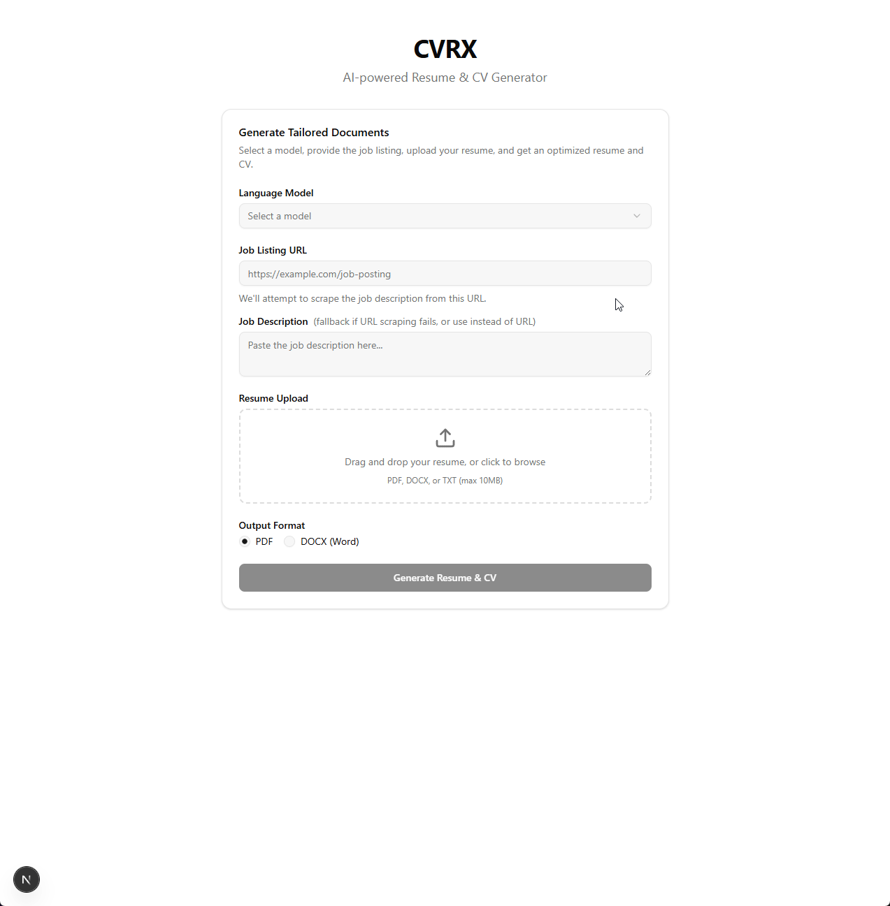
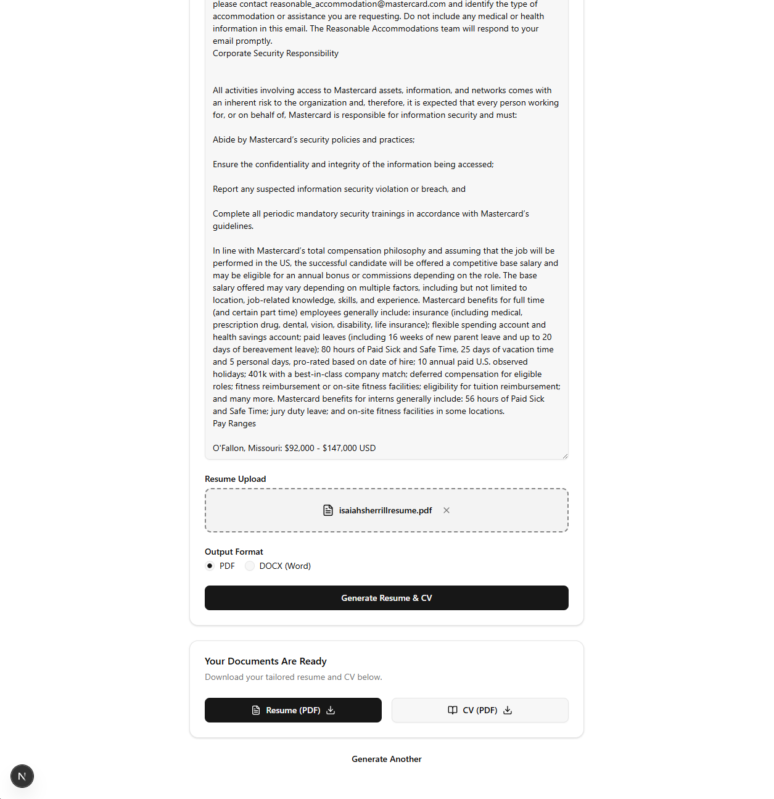

# CVRX

AI-powered resume and CV generator. Provide a job listing and your existing resume, select a language model via [OpenRouter](https://openrouter.ai), and receive a tailored resume and comprehensive CV ready to download.

## Demo



### Generated Output



## Features

- **Model Selection** — Choose from any LLM available on OpenRouter (Claude, GPT-4, Llama, Gemini, etc.)
- **Job Listing Scraping** — Paste a URL and the app scrapes the job description automatically, with a manual text fallback
- **Multiple Upload Formats** — Upload your resume as PDF, DOCX, or plain text
- **Two Output Documents** — Get both a concise, ATS-optimized resume and a comprehensive CV
- **PDF & DOCX Output** — Download your documents in either format
- **Containerized** — Full Docker Compose setup for easy deployment

## Tech Stack

| Layer | Technology |
|-------|-----------|
| Frontend | Next.js 16, React 19, TailwindCSS 4, Shadcn UI |
| Backend | Express.js 5, TypeScript |
| AI | OpenRouter API (OpenAI-compatible) |
| Document Generation | docx (Word), PDFKit (PDF), mammoth & pdf-parse (parsing) |
| Scraping | Cheerio (static HTML parsing) |
| Validation | Zod |
| Containerization | Docker, Docker Compose |
| Package Manager | pnpm workspaces |

## Prerequisites

- **Node.js** >= 22 (see `.nvmrc`)
- **pnpm** >= 9
- **OpenRouter API key** — Get one at [openrouter.ai/keys](https://openrouter.ai/keys)
- **Docker** (optional, for containerized deployment)

## Quick Start

```bash
# Clone the repo
git clone https://github.com/your-username/cvrx.git
cd cvrx

# Use correct Node version (if using nvm)
nvm use

# Install dependencies and create .env
make setup

# Add your OpenRouter API key to .env
# Edit .env and set OPENROUTER_API_KEY=your_key_here

# Start development servers
make dev
```

The frontend runs at `http://localhost:3000` and the backend at `http://localhost:3001`.

## Environment Variables

Create a `.env` file in the project root (or copy from `.env.example`):

| Variable | Description | Default |
|----------|-------------|---------|
| `OPENROUTER_API_KEY` | Your OpenRouter API key | *required* |
| `OPENROUTER_BASE_URL` | OpenRouter API base URL | `https://openrouter.ai/api/v1` |
| `PORT` | Backend server port | `3001` |
| `TEMP_DIR` | Temp directory for generated files | `/tmp/cvrx` |
| `TEMP_FILE_TTL_MS` | How long generated files are kept (ms) | `600000` (10 min) |
| `NODE_ENV` | Environment mode | `development` |
| `NEXT_PUBLIC_API_URL` | Backend URL for the frontend | `http://localhost:3001` |

## Docker

```bash
# Build and start all containers
make docker-build
make docker-up

# View logs
make docker-logs

# Stop containers
make docker-down
```

## Makefile Commands

| Command | Description |
|---------|-------------|
| `make install` | Install all dependencies |
| `make setup` | Install deps + create .env from template |
| `make dev` | Start frontend and backend in dev mode |
| `make dev-frontend` | Start frontend only |
| `make dev-backend` | Start backend only |
| `make build` | Build all packages for production |
| `make lint` | Run linters across all packages |
| `make lint-fix` | Run linters with auto-fix |
| `make format` | Format code with Prettier |
| `make typecheck` | Run TypeScript type checking |
| `make docker-build` | Build Docker images |
| `make docker-up` | Start containers in background |
| `make docker-down` | Stop containers |
| `make docker-logs` | Tail container logs |
| `make docker-restart` | Restart containers |
| `make clean` | Remove build artifacts and node_modules |

## Project Structure

```
cvrx/
├── packages/
│   ├── shared/          # Shared TypeScript types (API contract)
│   ├── frontend/        # Next.js app with Shadcn UI
│   │   └── src/
│   │       ├── app/           # Next.js App Router pages
│   │       ├── components/    # React components (+ Shadcn UI primitives)
│   │       ├── hooks/         # Custom React hooks
│   │       └── lib/           # Utilities and API client
│   └── backend/         # Express.js API server
│       └── src/
│           ├── routes/        # API route handlers
│           ├── services/      # Business logic (scraper, parser, AI, doc gen)
│           ├── middleware/     # Express middleware (CORS, upload, errors)
│           └── utils/         # Temp file management
├── .env.example         # Environment variable template
├── docker-compose.yml   # Container orchestration
├── Makefile             # Project commands
└── pnpm-workspace.yaml  # Monorepo workspace config
```

## API Endpoints

| Method | Path | Description |
|--------|------|-------------|
| `GET` | `/api/models` | List available OpenRouter models |
| `POST` | `/api/generate` | Generate resume and CV (multipart form) |
| `GET` | `/api/download/:jobId/:docType?format=pdf\|docx` | Download generated document |
| `GET` | `/api/health` | Health check |

## How It Works

1. **Select a model** from the dropdown (fetched from OpenRouter)
2. **Provide the job listing** via URL (auto-scraped) or paste the description manually
3. **Upload your current resume** (PDF, DOCX, or TXT)
4. **Choose output format** (PDF or DOCX)
5. **Submit** — the backend scrapes the job description, parses your resume, sends both to the selected LLM with tailored prompts, and generates two documents
6. **Download** your tailored resume and comprehensive CV

## Contributing

1. Fork the repository
2. Create a feature branch (`git checkout -b feature/my-feature`)
3. Make your changes
4. Run `make lint && make typecheck` to verify
5. Commit your changes (`git commit -m 'Add my feature'`)
6. Push to the branch (`git push origin feature/my-feature`)
7. Open a Pull Request

## License

MIT
